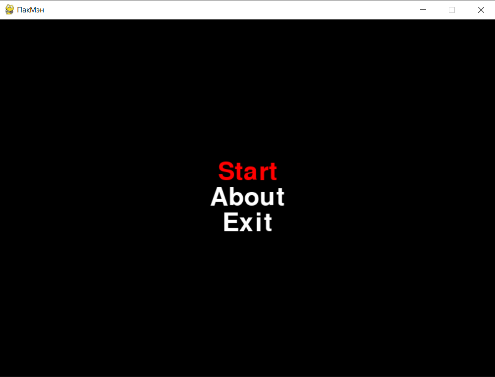
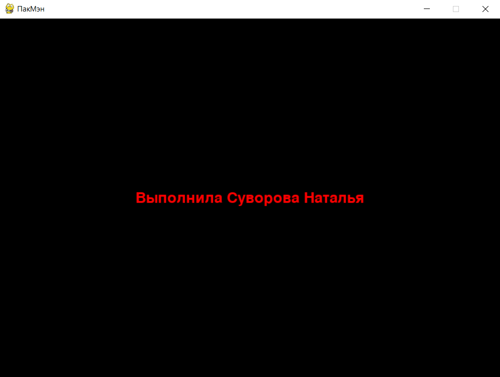
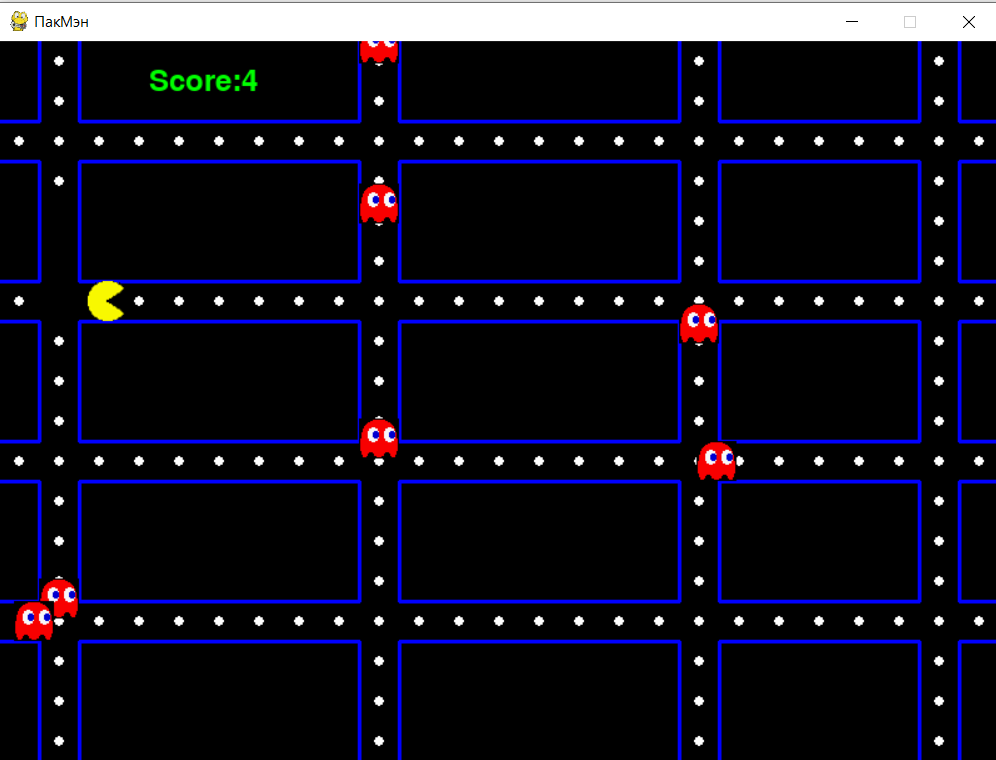
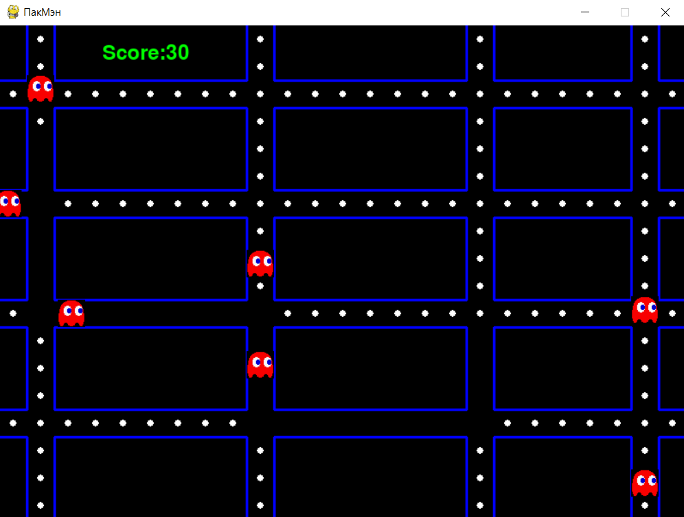

# Игра ПакМэн на Pygame

Бесконечная игра, где игрок собирает очки за съеденные кружки на поле. В игре есть меню, информация о разработчике и игровое поле.

**Выполнила Суворова Наталия БСБО-06-22**

Скриншоты:

